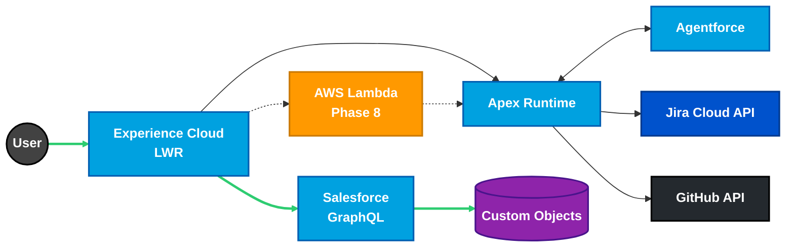

# Hi, I'm Ryan Bumstead 👋

### ☁️ Salesforce Platform Architect
> Building governed, resilient systems with GlassOps and open-source patterns.

**📄 Professional Materials**  

  

**📫 Connect With Me**  

  

---

I bridge the gap between executive strategy and enforceable technical architecture, specializing in **architecture-first delivery**, **DevOps maturity**, and **resilience engineering** for governed, multi-cloud systems (Salesforce + AWS).

### 🛠 Tech Stack

| Domain | Stack |
| :--- | :--- |
| **☁️ Salesforce** | **Apex** · **LWC** · **Agentforce** · **Flow Builder** |
| **⚡ Cloud** | **AWS Lambda** · **S3** · **Multi-Cloud Architecture** |
| **🚀 DevOps** | **Reusable Workflows** · **GitHub Actions** · **SFDX CLI** · **Docker** |
| **📐 Architecture** | **OpenAPI 3.0** · **Event-Driven** · **C4 Modeling** |

### 📐 System Architecture
*A high-level view of the multi-cloud pattern used in my reference implementation.*

---

### 📂 Engineering Highlights

#### [GlassOps Governance Protocol](https://github.com/glassops-platform/glassops)

> *A governance-first protocol for Salesforce CI/CD that separates policy enforcement from execution.*

> [!TIP]
> **Check out the [Overview](https://github.com/glassops-platform/glassops/blob/main/docs/overview.md)!**

- **Governance Control Plane:** Designed a system enforcing deployment outcomes independently of tooling.
- **Policy & Contract Model:** Defined a model that normalizes results across execution engines such as native sf CLI and sfdx-hardis.
- **Pluggable Adapter Pattern:** Architected a pattern allowing teams to swap execution engines without breaking compliance guarantees.
- **Deployment Governance:** Formalized concepts including policy resolution, validation gates, and pass or fail arbitration.
- **Tooling Strategy:** Positioned mature tools like sfdx-hardis as **first-class execution adapters**, not competitors.
- **System Documentation:** Authored protocol-level architecture documentation treating governance as a system concern rather than a pipeline feature.

#### [Salesforce Platform Architect Portfolio](https://github.com/rdbumstead/salesforce-platform-architect-portfolio)
   

> *An open-source reference implementation for enterprise delivery patterns.*

> [!TIP]
> **View the full documentation in the [Governance Hub](https://rdbumstead.github.io/salesforce-platform-architect-portfolio/) for the best reading experience.**

* **The Architecture:** Designed a multi-cloud system using Salesforce LWR, GraphQL, Apex, and AWS Lambda.
* **The Governance:** Implemented contract-first APIs (OpenAPI 3.0) and "Chaos Engineering" patterns to validate resilience against third-party failures.
* **The Ops:** Zero-touch CI/CD with automated quality gates.
* **Documentation:** Read my [Architectural Decision Records (ADRs)](https://github.com/rdbumstead/salesforce-platform-architect-portfolio/tree/main/docs/adr) to see how I handle security, FinOps, and resilience trade-offs.

#### ["Resume as Code" CI/CD Pipeline](https://github.com/rdbumstead/resume-as-code)
 
> *Treating professional career documentation as a software product.*

* **Infrastructure as Code:** Architected an event-driven pipeline that transforms Markdown source into immutable PDF artifacts.
* **Security Architecture:** Decoupled PII (Phone/Email) using GitHub Secrets to enable safe public repository visibility.
* **Automated Governance:** Engineered custom scripts to enforce formatting standards and validate hyperlinks before compilation.

#### [Setup Salesforce CLI Action](https://github.com/rdbumstead/setup-salesforce-action)

 

> *A production-ready GitHub Action for Salesforce CI/CD pipelines.*

* **Self-Healing Architecture:** Engineered exponential backoff logic for high availability and fault tolerance.
* **Strict-Mode Governance:** Implemented automated quality gates to enforce enterprise coding standards.
* **Cross-Platform Design:** Built the foundation for modular reusable workflows supporting Linux and Windows.
* **Performance:** Intelligent caching strategy reducing setup time by **80%** (20s vs 2m).

### 📜 Certifications
* Salesforce Certified Agentforce Specialist
* Salesforce Certified Data Cloud Consultant
* Salesforce Certified Education Cloud Consultant
* Salesforce Certified Platform App Builder
* Salesforce Certified Platform Administrator
* Salesforce Certified Platform Administrator II

[Verify these credentials on Trailhead ↗](https://www.salesforce.com/trailblazer/rbumstead)

---

**Looking for a Salesforce Platform Architect who thinks in systems and delivers with precision? Let's connect above!**
