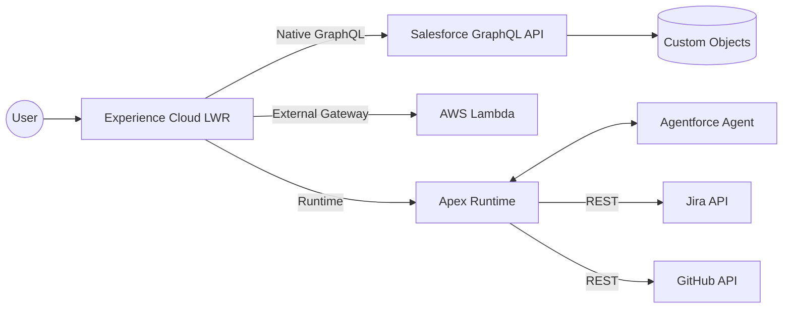

# Hi, I'm Ryan Bumstead 👋

### ☁️ Salesforce Platform Architect

**📄 Professional Materials**  
  

**📫 Connect With Me**  
  

---

I bridge the gap between executive strategy and enforceable technical architecture, specializing in **architecture-first delivery**, **DevOps maturity**, and **resilience engineering** for governed, multi-cloud systems (Salesforce + AWS).

### 🛠 Tech Stack
* **Salesforce Platform:** Apex, LWC, LWR, Agentforce, Flow
* **Architecture:** API-First (OpenAPI 3.0), Event-Driven, C4 Modeling
* **DevOps:** GitHub Actions, SFDX, Docker, JWT Auth, PMD
* **Cloud:** AWS Lambda, S3, Multi-Cloud Patterns

### 📐 System Architecture
*A high-level view of the multi-cloud pattern used in my reference implementation.*

---

### 📂 Engineering Highlights

#### [Architecture-First Reference Implementation](https://github.com/rdbumstead/salesforce-platform-architect-portfolio)
> *An open-source reference implementation for enterprise delivery patterns.*

* **The Architecture:** Designed a multi-cloud system using Salesforce LWR, GraphQL, Apex, and AWS Lambda.
* **The Governance:** Implemented contract-first APIs (OpenAPI 3.0) and "Chaos Engineering" patterns to validate resilience against third-party failures.
* **The Ops:** Zero-touch CI/CD with automated quality gates.
* **Documentation:** Read my [Architectural Decision Records (ADRs)](https://github.com/rdbumstead/salesforce-platform-architect-portfolio/tree/main/docs/adr) to see how I handle security, FinOps, and resilience trade-offs.

#### ["Resume as Code" CI/CD Pipeline](https://github.com/rdbumstead/resume-as-code) &nbsp;&nbsp;  
> *Treating professional career documentation as a software product.*

* **Infrastructure as Code:** An event-driven pipeline that transforms Markdown source into immutable PDF artifacts using GitHub Actions and Docker.
* **Security First:** Implemented a "Secrets-First" pattern, decoupling PII (Phone/Email) from the codebase using GitHub Secrets.
* **Automated Quality:** Custom Node.js scripts audit hyperlinks and inject portfolio statistics before compilation.

### 📜 Certifications
* Salesforce Agentforce Specialist
* Salesforce Data Cloud Consultant
* Salesforce Education Cloud Consultant
* Salesforce Platform App Builder
* Salesforce Administrator I & II

---

*Looking for a Salesforce Platform Architect who thinks in systems and delivers with precision? Let's connect above!*
