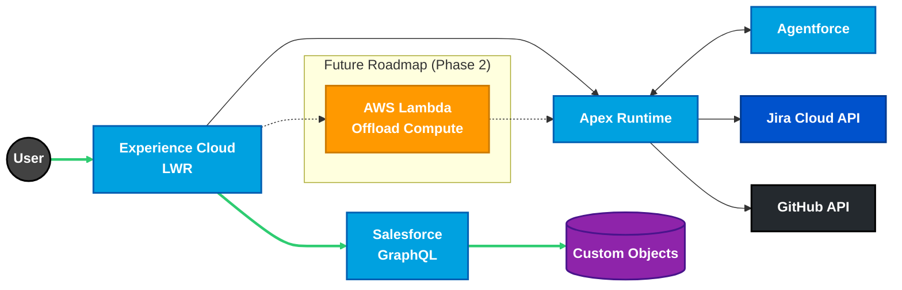

Hi, I'm Ryan Bumstead

### Salesforce Platform Architect & Governance Lead
> Governance-first CI/CD design & reference implementation (in active development)

---

### Resumes & Documentation

> [!NOTE]
> PDFs are generated as secure release artifacts to protect PII. Click the badge to download the latest build.*

**Standard Resume**

 

**Platform Engineer Resume**

 

**Comprehensive Resume** *(Technical Deep Dive)*

 

**Connect With Me**  

  

---

I design Salesforce platforms that balance **developer velocity** with **system integrity**, specializing in **multi-org architecture**, **DevOps governance**, and **governance-first deployment models** for higher education and nonprofit environments.

**Core Focus Areas:**
- Architecture-first delivery
- Governance-driven DevOps  
- Resilient multi-cloud systems (Salesforce + AWS)

### Tech Stack

| Domain | Stack |
| :--- | :--- |
| **Salesforce** | **Apex** · **LWC** · **Agentforce** · **Flow Builder** |
| **Cloud** | **AWS Lambda** · **S3** · **Multi-Cloud Architecture** |
| **DevOps** | **Reusable Workflows** · **GitHub Actions** · **SFDX CLI** · **Docker** |
| **Architecture** | **OpenAPI 3.0** · **Event-Driven** · **Secure by Design** |
| **Languages & Tools** | **Go** · **Python** · **TypeScript** · **JavaScript** · **YAML** · **Pandoc** · **XeLaTeX** · **Mermaid.js** |

### System Architecture
*A high-level view of the multi-cloud pattern used in my reference implementation.*

---

### Engineering Highlights

#### [GlassOps Governance Protocol](https://github.com/glassops-platform/glassops)

> An Open Source (Apache 2.0) Standard for Salesforce DevOps that separates policy enforcement from execution.

> [!TIP]
> **Check out the [Overview](https://github.com/glassops-platform/glassops/blob/main/docs/architecture/overview.md)!**

- **Governance Control Plane:** Designed a system intended to enforce deployment outcomes independently of tooling.
- **Policy & Contract Model:** Defined a model that normalizes results across execution engines such as native sf CLI and sfdx-hardis.
- **Pluggable Adapter Pattern:** Architected a pattern allowing teams to swap execution engines without breaking compliance guarantees.
- **Deployment Governance:** Formalized concepts including policy resolution, validation gates, and pass or fail arbitration.
- **Tooling Strategy:** Positioned mature tools like sfdx-hardis as **first-class execution adapters**, not competitors.
- **System Documentation:** Authored protocol-level architecture documentation treating governance as a system concern rather than a pipeline feature.

#### [GlassOps Runtime](https://github.com/glassops-platform/glassops-runtime)

> *Production-grade execution infrastructure designed to provide the foundational layer for GlassOps governance.*

- **Verified Primitives:** Engineered comprehensive test coverage ensuring consistent behavior across execution contexts.
- **Governed Authentication:** Implemented authentication contracts supporting JWT, OAuth, and SFDX Auth URL patterns.
- **Plugin Security:** Designed whitelist enforcement preventing unauthorized Salesforce CLI extensions.
- **Governed Execution:** Enforces strict timeouts, validates inputs, and provides structured error handling with clear failure modes.
- **Infrastructure Guarantees:** Established the foundational layer ensuring deployment outcomes are reproducible and auditable.

> [!NOTE]
> **Powers the GlassOps Governance Protocol execution layer.** Governance guarantees require infrastructure guarantees.

#### [Salesforce Platform Architect Portfolio](https://github.com/rdbumstead/salesforce-platform-architect-portfolio)
   

> *An open-source reference implementation for enterprise delivery patterns.*

> [!TIP]
> **View the full documentation in the [Governance Hub](https://rdbumstead.github.io/salesforce-platform-architect-portfolio/) for the best reading experience.**

* **The Architecture:** Designed a multi-cloud system using Salesforce LWR, GraphQL, Apex, and AWS Lambda.
* **The Governance:** Architected contract-first APIs (OpenAPI 3.0) and "Chaos Engineering" patterns to validate resilience against third-party failures.
* **The Ops:** Zero-touch CI/CD with automated quality gates.
* **Documentation:** Read my [Architectural Decision Records (ADRs)](https://github.com/rdbumstead/salesforce-platform-architect-portfolio/tree/main/docs/adr) to see how I handle security, FinOps, and resilience trade-offs.

#### [Setup Salesforce CLI Action](https://github.com/rdbumstead/setup-salesforce-action)

 

> *A production-ready GitHub Action for Salesforce CI/CD pipelines.*

* **Self-Healing Architecture:** Engineered exponential backoff logic for high availability and fault tolerance.
* **Strict-Mode Governance:** Implemented automated quality gates to enforce enterprise coding standards.
* **Cross-Platform Design:** Built the foundation for modular reusable workflows supporting Linux and Windows.
* **Performance:** Intelligent caching strategy reducing setup time by **80%** (20s vs 2m).

#### ["Resume as Code" CI/CD Pipeline](https://github.com/rdbumstead/resume-as-code)

> *Treating professional career documentation as a software product.*

* **Security-First Architecture:** Engineered custom Node.js assembly engine that dynamically injects job titles ("Golden Headers") and PII at runtime using GitHub Secrets.
* **Governance Pipeline:** Automated validation for formatting standards and hyperlink integrity before compilation.
* **High-Fidelity Compilation:** Orchestrated PDF generation using Pandoc and XeLaTeX for pixel-perfect rendering.
* **Decoupled Architecture:** Separated public source code (Markdown) from private contact information in compiled artifacts.

### Certifications
* Salesforce Certified Agentforce Specialist
* Salesforce Certified Data Cloud Consultant
* Salesforce Certified Education Cloud Consultant
* Salesforce Certified Platform App Builder
* Salesforce Certified Platform Administrator I & II

[Verify these credentials on Trailhead ↗](https://www.salesforce.com/trailblazer/rbumstead)

---

**I help organizations evolve from "fragile features" to resilient, governed ecosystems.**
